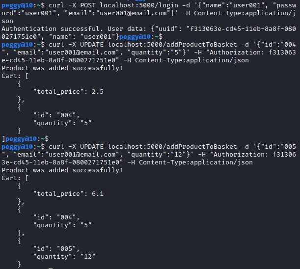
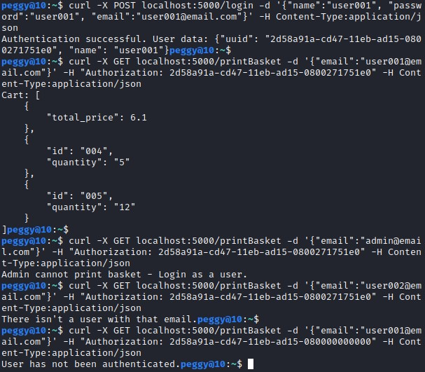
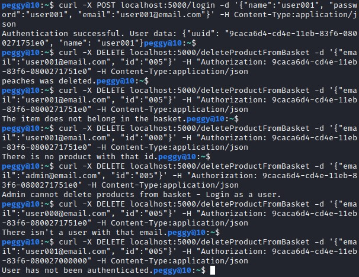
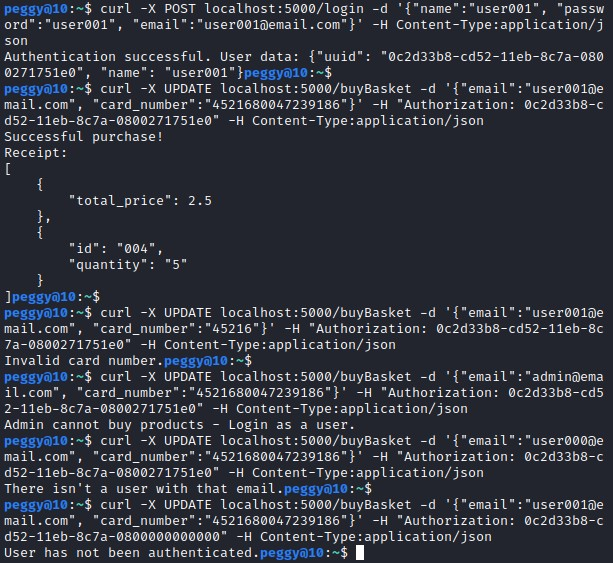
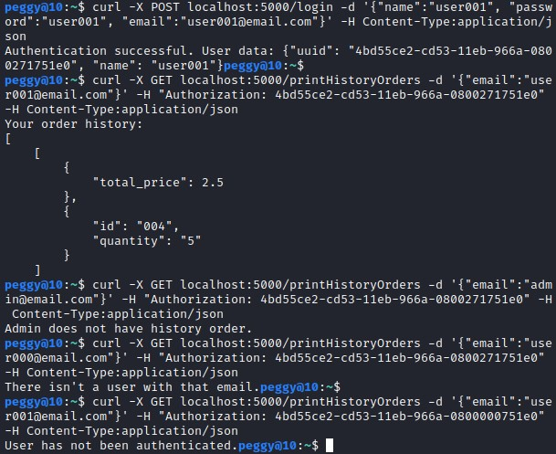
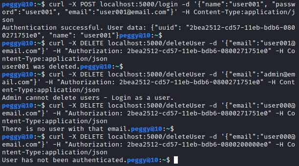

<h1>Ergasia_2_E18025_Vitsa_Panagiota</h1>

<h2>Introduction</h2>
<p>This project is made possible using mongodb database, python and flask. The execution of this application took place in linux, kali. It is written in python 3, implementing various entrypoints, such as get, post, update and delete.</p><br/>
<p>In this project the goal is to manage a market - a mongodb database named 'DSMarkets', including two types of users, admins and simple users each have a different category either 'admin' or 'user'. They have different possibilities, such as that only an admin can create the products of the collection, edit them or delete them.</p>
<p>Simple users can login, search for products based on their name, category or id, add products to their basket, see the content of their basket, delete products from the basket or checkout. They can also view their order history, or delete their account.</p>
<p>Those are all executed with a variety of different entrypoints.</p><br/>

<h2>Containerization</h2>
<p>After the completion of the code, the next step is to containerize our web service. Containerization is a virtualization of our operating system. It contains our web service and all of its essential libraries and files that it needs in order to execute correctly. Containerization is very useful because it will be easier for the user to run two containers at the same time rather than running them separately. The aforementioned containers are mongodb and the flask service. A new file named docker-compose.yml will be created so that the two services can communicate. </p>
<p>First, we execute the Dockerfile. </p><br/>
<p>Subsequently, we will analyze all of the functions that our app.py file contains.</p>

<h2>Basic Functions</h2>
<p>First of, we've created some basic functions. Those are to help us create the user session, check validity of a specific session, get the content of both collections (Users, Products) and then two extra functions to create admins or simple users. We only have one admin and one user - though we can add more if we want.</p>

<br/>

<h2>Admin Functions</h2>
<h3>Insert Product</h3>
<p>The admin is able to add products in the 'Products' collection of the 'DSMarkets' database.</p>

````python 
admin = users.find_one({"email":data['email']})
    if admin != None: #if user exists
        if admin['category'] == 'admin':
            #if product doesn't exist in the database
            if products.find({"id":data["id"]}).count() == 0:
                #then store the product in a dictionary 'product'
                if "description" in data: #description is an optional field
                    product = {"id": data['id'], "name": data['name'], "category":data['category'], "stock":data['stock'], "description":data['description'], "price":data['price']}
                else: #if the admin does not give product description
                    product = {"id": data['id'], "name": data['name'], "category":data['category'], "stock":data['stock'], "price":data['price']}
                #insert the data in 'Products' collection
                products.insert_one(product)

                #successful message
                return Response(data['name'] + " was added to the collection Products!", status=200, mimetype='application/json')
            else:
                #error message - user already exists
                return Response("This product already exists.", status=401, mimetype='application/json')
        else: 
            return Response("Only admin allowed to execute this.") #not an admin category
    else:
        return Response("There isn't an admin with that email.") #admin does not exist
````

<p>Firstly, the admin gives their email in order to validate if they exist and are an admin.</p>
<p>If the id of the product doesn't exist in the collection 'Products', then the product doesn't already exist and procceeds to add it. Description is an optional field, so if the admin didn't enter it then it doesn't pass in the base.</p><br/>

<p>Command: </p>

````bash
curl -X UPDATE localhost:5000/insertProduct -d '{"email":"admin@email.com", "id":"005", "name":"peaches", "category":"fruits", "stock":"60", "price":"0.30"}' -H Content-Type:application/json
````

<p>Results: </p>


<h3>Update Product</h3>
<p>The admin is able to update a product.</p>

````python 
admin = users.find_one({"email":data['email']})
    if admin != None: #if user exists
        if admin['category'] == 'admin':
            product = products.find_one({"id":data["id"]}) #find product by id
            if product != None: #if product exists, update the content
                #set the new values
                if "name" in data:
                    product = products.update_one({'id':data["id"]}, {'$set': {'name':data["name"]}}) #set the new name
                if "price" in data:
                    product = products.update_one({'id':data["id"]}, {'$set': {'price':data["price"]}}) #set the new price
                if "description" in data:
                    product = products.update_one({'id':data["id"]}, {'$set': {'description':data["description"]}}) #set the new description
                if "stock" in data:
                    product = products.update_one({'id':data["id"]}, {'$set': {'stock':data["stock"]}}) #set the new stock
                msg = "Updated successfully"
                return Response(msg, status=200, mimetype='application/json')
            else: #if product doesn't exist, print corresponding message
                return Response("There is no product with that id.", status=500, mimetype='application/json')
        else: 
            return Response("Only admin allowed to execute this.") #not an admin category
    else:
        return Response("There isn't an admin with that email.") #admin does not exist
````

<p>Firstly, the admin gives their email in order to validate if they exist and are an admin.</p>
<p>If the id of the product exists in the collection 'Products', then the product exists and then the program updates any of the fields given.</p><br/>

<p>Command: </p>

````bash
curl -X UPDATE localhost:5000/updateProduct -d '{"email":"admin@email.com", "id":"005", "price":"0.15", "stock":"80", "description":"fresh peaches"}' -H Content-Type:application/json
````

<p>Results: </p>


<h3>Delete Product</h3>
<p>The admin is able to delete a product.</p>

````python 
admin = users.find_one({"email":data['email']})
    if admin != None: #if user exists
        if admin['category'] == 'admin':
            product = products.find_one({"id":data["id"]}) #find product by id
            if product != None: #if product exists, delete it
                products.delete_one(product) #delete
                product_name = product["name"] #insert in var the name of the product in order to print it later
                msg = product_name + " was deleted." #delete verification message
                return Response(msg, status=200, mimetype='application/json') #successful message and status
            else: #if product doesn't exist, print corresponding message
                return Response("There is no product with that id.")
        else: 
            return Response("Only admin allowed to execute this.") #not an admin category
    else:
        return Response("There isn't an admin with that email.") #admin does not exist
````

<p>Firstly, the admin gives their email in order to validate if they exist and are an admin.</p>
<p>If the id of the product exists in the collection 'Products', then the product exists and the program deletes it.</p><br/>

<p>Command: </p>

````bash
curl -X DELETE localhost:5000/deleteProduct -d '{"email":"admin@email.com", "id":"005"}' -H Content-Type:application/json
````

<p>Results: </p>
<br/>

<h2>Simple-User Functions</h2>
<h3>Login</h3>
<p>The simple user is able to login with their name password and email. The email is needed in order to identify them in the 'Users' collection.</p>

````python 
#if user exists 
    user = users.find_one({"email":data['email']})
    if user != None: #if user exists
        if user['category'] == 'user': #if user is not an admin
            if users.find_one( {"$and": [ {"name":data['name']}, {"password":data['password']}] } ):
                user_uuid = create_session(data['name']) #create user session
                res = {"uuid": user_uuid, "name": data['name']} #assign data in res variable in order to print them later
                return Response("Authentication successful. User data: " + json.dumps(res), mimetype='application/json', status=200) #successful message
            else: #unsuccessful login - status error
                return Response("Wrong username or password.", status=400, mimetype='application/json')
        else: 
            return Response("Admins cannot login - You have to be a user.")
    else:
        return Response("There isn't a user with that email.")
````

<p>The admin gives their email in order to validate if they exist and are in the simple user category.</p>
<p>If they exist, then find the user with the right name-password combination and create their user session - meaning a unique user id (uuid). Having that, the user can enter it while executing a function and that will make sure the session is valid and the user is authenticated. </p><br/>

<p>Command: </p>

````bash
curl -X POST localhost:5000/login -d '{"name":"user001", "email":"user001@email.com", "password":"user001"}' -H Content-Type:application/json
````

<p>Results: </p>


<h3>Get Products</h3>
<p>When a user calls this function, it prints the products they asked. They can only enter one name, category or id at a time. For that, the admin entered some more products in order to have a more successful presentation of the entrypoint: </p>


````python 
uuid = request.headers.get('Authorization') #get uuid from user
    if is_session_valid(uuid) : #if uuid is valid, then execute the entrypoint
        user = users.find_one({"email":data['email']})
        if user != None: #if user exists
            if user['category'] == 'user': #if user is not an admin
                a = 0
                product_list = []
                if "name" in data: #product based on name
                    products1 = products.find({"name":data['name']})
                    if products1 != 0: #product exists
                        for product in products1:
                            product['_id'] = None
                            product_list.append(product) #add each product to the list
                            a = 1
                    
                    if len(product_list) == 0: #product does not exist
                        return Response("There are no products with that name.")
                elif "category" in data: #product based on category
                    products1 = products.find({"category":data['category']})
                    if products1 != None: #product exists
                        for product in products1:
                            product['_id'] = None
                            product_list.append(product) #add each product to the list
                            a = 1
                        for i in range(len(product_list)): #ascending order with bubblesort
                            for j in range(0, len(product_list)-i-1):
                                if product_list[j].get("price") > product_list[j+1].get("price"):
                                    temp = product_list[j]
                                    product_list[j] = product_list[j+1]
                                    product_list[j+1] = temp

                    if len(product_list) == 0: #product does not exist
                        return Response("There are no products in this category.")
                elif "id" in data: #product based on id
                    products1 = products.find({"id":data['id']})
                    if products1 != 0: #product exists
                        for product in products1:
                            product['_id'] = None
                            product_list.append(product) #add each product to the list
                            a = 1

                    if len(product_list) == 0: #product does not exist
                        return Response("There is no product with that id.")

                if a == 1: #if one of the three existed, then print the products' list
                    return Response(json.dumps(product_list, indent=4), status=200, mimetype='application/json')
            else: #if user is an admin
                return Response("Admin cannot get products - Login as a user.\n")
        else: #user does not exist
            return Response("There isn't a user with that email.")
    else:  #user not authenticated
        return Response("User has not been authenticated.", status=401, mimetype='application/json')

````

<p>If the user enters a specific name then it creates a product list in which there will be passed all the products that have the same name. </p>
<p>If the user enters a specific category, the code finds the products and enters them into a product list. Then it procceeds to sort them with an ascending bubblesort based on their price. </p>
<p>If they enter the id and a product exists, it is inserted in the product list and is only one item since we can't have two products with the same id. </p>

<p>Command: </p>

````bash
curl -X GET localhost:5000/getProducts -d '{"category":"dairy", "email":"user001@email.com"}' -H "Authorization: 437c65d2-cd2f-11eb-9309-0800271751e0" -H Content-Type:application/json
````

<p>Results: </p>


<h3>Add Product to Basket</h3>
<p>The user is able to add products to their basket. The email is needed in order to identify them in the 'Users' collection. </p>

````python
uuid = request.headers.get('Authorization') #get uuid from user
    if is_session_valid(uuid) : #if uuid is valid, then execute the entrypoint
        user = users.find_one({"email":data['email']})
        if user != None: #if user exists
            if user['category'] == 'user': #if user is not an admin
                product = products.find_one({"id":data['id']}) #find the product in the 'Products' collection

                if product != None: #if product exists
                    if int(data["quantity"]) <= int(product["stock"]): #check if stock has enough items
                        cart = user["basket"] #local cart
                        cart.append({'id':data["id"], 'quantity':data["quantity"]}) #add the product

                        tp = user['basket'][0].get('total_price') + float(data["quantity"])*float(product["price"])
                        cart[0] = {'total_price':tp} #calculate the new total price of the basket after adding the product's price

                        user = users.update_one( {'email':data["email"]}, 
                                                {"$set": 
                                                        {"basket":cart} #set to the collection's basket the local one     
                                                }
                                            )

                        #successful message
                        return Response("Product was added successfully! \nCart: " + json.dumps(cart, indent = 4))
                    else: #stock not enough
                        return Response("The requested quantity is exceeding the product's stock.")
                else: #print error message
                    return Response("There is no product with that id.")
            else: #if user is an admin
                return Response("Admin cannot add products to basket - Login as a user.\n")
        else: #user does not exist
            return Response("There isn't a user with that email.")
    else:  #user not authenticated
        return Response("User has not been authenticated.", status=401, mimetype='application/json')
````

<p>In case the product the user's asking exists in the collection, then a local cart is created that has assigned the user's basket and there we append the new product. In that way, the user doesn't lose any possible previous products that they've added during their shopping hours there. Later on, before setting the local cart into the user's basket we check if the quantity they ask for the specific product does not exceed the product's stock. If not, the total price of the cart is calculated and then the cart is set to the user's basket.</p>

<p>Command: </p>

````bash
curl -X UPDATE localhost:5000/addProductToBasket -d '{"id":"004", "email":"user001@email.com", "quantity":"5"}' -H "Authorization: f313063e-cd45-11eb-8a8f-0800271751e0" -H Content-Type:application/json
````

<p>Results:</p>


<h3>Print Basket</h3>
<p>Through that function the user is able to see the products of their basket. The email is needed in order to identify them in the 'Users' collection. </p>

````python
uuid = request.headers.get('Authorization') #get uuid from user
    if is_session_valid(uuid) : #if uuid is valid, then execute the entrypoint
        user = users.find_one({"email":data['email']})
        if user != None: #if user exists
            if user['category'] == 'user': #if user is not an admin
                return Response("Cart: " + json.dumps(user['basket'], indent = 4))
            else: #if user is an admin
                return Response("Admin cannot print basket - Login as a user.\n")
        else: #user does not exist
            return Response("There isn't a user with that email.")
    else: #user not authenticated
        return Response("User has not been authenticated.", status=401, mimetype='application/json')
````

<p>Command: </p>

````bash
curl -X GET localhost:5000/printBasket -d '{"email":"user001@email.com"}' -H "Authorization: 2d58a91a-cd47-11eb-ad15-0800271751e0" -H Content-Type:application/json
````

<p>Results: </p>


<h3>Delete Product from Basket</h3>
<p>Through that function the user is able to delete products of their basket. The email is needed in order to identify them in the 'Users' collection. </p>

````python
uuid = request.headers.get('Authorization') #get uuid from user
    if is_session_valid(uuid) : #if uuid is valid, then execute the entrypoint
        user = users.find_one({"email":data['email']})
        if user != None: #if user exists
            if user['category'] == 'user': #if user is not an admin
                productBasket = None
                k=-1
                product = products.find_one({"id":data['id']})

                if product != None:
                    for i in range (1, len(user['basket'])): #for each product in basket
                        id1 = user['basket'][i].get('id') #save the id
                        if id1 == data['id']: #if the id matches the user's data then the product exists
                            productBasket = user["basket"][i] #save the product in a variable
                            k = i #save the index of the product in a variable

                    if productBasket != None: #if the product the user wants to delete exists
                        basket1 = user["basket"] #create local basket to make changes and then set it to the collection

                        tp = user['basket'][0].get('total_price') - float(user["basket"][k]["quantity"])*float(product["price"]) #calculate the new total price after subtracting the product's price the user wants to delete 
                        basket1[0] = {'total_price':tp} #insert new total price to local basket

                        basket1.pop(k) #remove the product
                        
                        user = users.update_one( {'email':data["email"]}, 
                                                {"$set": 
                                                        {"basket":basket1} #set to the collection's basket the local one
                                                }
                                            )

                        product_name = product["name"] #insert in var the name of the product in order to print it later
                        msg = product_name + " was deleted." #delete verification message
                        return Response(msg, status=200, mimetype='application/json') #successful message and status
                    else: #product doesn't exist
                        return Response("The item does not belong in the basket.")
                else: #print error message
                    return Response("There is no product with that id.")
            else: #if user is an admin
                return Response("Admin cannot delete products from basket - Login as a user.\n")
        else:
            return Response("There isn't a user with that email.")
    else: #user not authenticated
        return Response("User has not been authenticated.", status=401, mimetype='application/json')
````

<p>If the product actually exists, then a for loop starts to search through the user's basket in order to find it. If it exists, the product is assigned in a variable. Then in a local cart the user's basket is assigned and the total price is also reduced. After that, the product is deleted from the local cart ('pop' function) and the local cart is eventually set in the official basket of the user.</p>

<p>Command: </p>

````bash
curl -X DELETE localhost:5000/deleteProductFromBasket -d '{"email":"user001@email.com", "id":"005"}' -H "Authorization: 9caca6d4-cd4e-11eb-83f6-0800271751e0" -H Content-Type:application/json
````

<p>Results: </p>


<h3>Buy Basket</h3>
<p>Through that function the user is able to buy the products of their basket. The email is needed in order to identify them in the 'Users' collection. </p>

````python
uuid = request.headers.get('Authorization') #get uuid from user
    if is_session_valid(uuid) : #if uuid is valid, then execute the entrypoint
        user = users.find_one({"email":data['email']})
        if user != None: #if user exists
            if user['category'] == 'user': #if user is not an admin
                if user != None and len(data['cart_number'])==16:
                    cart = []
                    cart = user["basket"]

                    history = []
                    history = user["historyOrders"] #insert old history orders
                    history.append(cart) #insert the new order 

                    users.update_one( {'email':data["email"]}, 
                                            {"$set": 
                                                    {"historyOrders":history} #set the history orders with the total list
                                            }
                                        )

                    users.update_one( {'email':data["email"]},
                                            {"$set":
                                                    {"basket":[{'total_price':0}]} #reset user's basket
                                            }
                                        )

                    #print the receipt
                    return Response("Successful purchase!\nReceipt:\n" + json.dumps(cart, indent=4))
                else: #print error message
                    if len(data['cart_number'])!=16:
                        return Response("Invalid card number.")
            else: #if user is an admin
                return Response("Admin cannot buy products - Login as a user.\n")
        else:
            return Response("There isn't a user with that email.")
    else: #user not authenticated
        return Response("User has not been authenticated.", status=401, mimetype='application/json')
````

<p>If user exists and user's card number is exactly 16 digits, then procceed by creating a local cart and inserting the user's basket. After that we have to create a 'history' array, inserting all the older history orders of the user. The local cart will be inserted ('append' function) in the history orders as a new cart item, since we need a field that holds all of the previous orders of the user. </p>
<p>Finally, since the purchase is made and the basket of the user must be reset, we just set total price: 0 and the other fields just unset by themselves - therefore the basket is now empty.</p>

<p>Command: </p>

````bash
curl -X UPDATE localhost:5000/buyBasket -d '{"email":"user001@email.com", "card_number":"4521680047239186"}' -H "Authorization: 0c2d33b8-cd52-11eb-8c7a-0800271751e0" -H Content-Type:application/json
````

<p>Results: </p>


<h3>Print History Orders</h3>
<p>Through that function the user is able to see the history of the orders they've made. The email is needed in order to identify them in the 'Users' collection. </p>

````python
uuid = request.headers.get('Authorization') #get uuid from user
    if is_session_valid(uuid) : #if uuid is valid, then execute the entrypoint
        user = users.find_one({"email":data['email']})
        if user != None: #if user exists
            if user['category'] == 'user': #if user is not an admin then print their history orders
                return Response("Your order history: \n" + json.dumps(user["historyOrders"], indent=4))
            else: #if user is an admin
                return Response("Admin does not have history order.\n")
        else:
            return Response("There isn't a user with that email.")
    else: #user not authenticated
        return Response("User has not been authenticated.", status=401, mimetype='application/json')
````

<p>It prints the user's field 'historyOrders' that is set on the previous entrypoint.</p>

<p>Command: </p>

````bash
curl -X GET localhost:5000/printHistoryOrders -d '{"email":"user001@email.com"}' -H "Authorization: 4bd55ce2-cd53-11eb-966a-0800271751e0" -H Content-Type:application/json
````

<p>Results: </p>


<h3>Delete Simple-Users</h3>
<p>Through that function the user is able to delete themselves or other users. The email is needed in order to identify them in the 'Users' collection. </p>

````python
uuid = request.headers.get('Authorization') #get uuid from user
    if is_session_valid(uuid) : #if uuid is valid, then execute the entrypoint
        user = users.find_one({"email":data["email"]}) #find user by email
        if user != None: #if user exists
            if user['category'] == 'user': #if user is not an admin
                users.delete_one(user) #delete
                user_name = user["name"] #insert in var the name of the user in order to print it later
                msg = user_name + " was deleted." #delete verification message
                return Response(msg, status=200, mimetype='application/json') #successful message and status
            else: #if user is an admin
                return Response("Admin cannot delete users - Login as a user.\n")
        else: #if user doesn't exist, print corresponding message
            return Response("There is no user with that email.")
    else: #user not authenticated
        return Response("User has not been authenticated.", status=401, mimetype='application/json')
````

<p>If the user exists and they're not an 'admin' category (because admins cannot be deleted), then the user gets deleted from the collection.</p>

<p>Command: </p>

````bash 
curl -X DELETE localhost:5000/deleteUser -d '{"email":"user001@email.com"}' -H "Authorization: 2bea2512-cd57-11eb-bdb6-0800271751e0" -H Content-Type:application/json
````

<p>Results: </p>

